# 🏥 MediLedger Nexus Backend

<div align="center">


**🌟 Decentralized Health Data Ecosystem on Hedera 🌟**

*"Your Records. Your Control. Global Healthcare Revolution."*

[](https://python.org)
[](https://fastapi.tiangolo.com)
[](https://hedera.com)
[](LICENSE)
[](#testing)
[](#testing)

</div>

---

## 🚀 **Revolutionary Healthcare Platform**

MediLedger Nexus is a **groundbreaking healthcare platform** that combines the power of **blockchain technology**, **zero-knowledge proofs**, and **artificial intelligence** to create the world's first truly **patient-controlled health data ecosystem**. Built on the enterprise-grade **Hedera Hashgraph** network, it represents the future of healthcare data management.

## ✨ **Groundbreaking Features That Will Transform Healthcare**

<table>
<tr>
<td width="50%">

### 🔐 **Zero-Knowledge Health Vaults**
*The Fort Knox of Medical Data*

- 🏰 **Patient-Controlled Access**: You own your data, period
- 🎭 **zk-SNARK Proofs**: Prove you have diabetes without revealing your blood sugar levels
- 🛡️ **AES-256 Encryption**: Military-grade protection for your most sensitive information
- 🌐 **IPFS Storage**: Decentralized, tamper-proof, globally accessible
- ⚡ **Lightning Fast**: Access your records in <0.8 seconds

</td>
<td width="50%">

### 💰 **Tokenized Consent Economy**
*Get Paid for Your Data*

- 💎 **$HEAL Token**: Earn cryptocurrency when researchers access your anonymized data
- 🤖 **Smart Contracts**: Automated, trustless consent management on Hedera
- 💵 **Fair Compensation**: Transparent pricing - earn $5+ per month
- ⚙️ **Dynamic Consent**: Granular control - share only what you want
- 📊 **Real-time Earnings**: Track your data monetization in real-time

</td>
</tr>
<tr>
<td width="50%">

### 🤖 **AI Diagnostic Co-Pilot**
*Your Personal Medical AI Assistant*

- 🧠 **Federated Learning**: Train AI models without exposing raw data
- 🔗 **HCS-10 Agent Communication**: AI agents coordinate via Hedera Consensus Service
- 🔒 **Privacy-Preserving**: Get insights without compromising patient privacy
- 🎯 **Early Detection**: +40% diagnostic accuracy boost
- 🌍 **Global Intelligence**: Learn from millions of cases worldwide
- 🚀 **Groq AI Integration**: Lightning-fast AI responses

</td>
<td width="50%">

### 🚨 **Emergency Response Protocol**
*Save Lives in Critical Moments*

- ⚡ **Instant Access**: Critical data available in <0.3 seconds
- 📡 **HCS Broadcasting**: Real-time alerts to nearby hospitals
- 🎯 **Selective Disclosure**: Only essential information shared
- 📋 **Complete Audit Trail**: Every access logged immutably
- 🆘 **911 Integration**: Automatic data sharing during emergencies
- 🩸 **Critical Info**: Blood type, allergies, medications instantly available

</td>
</tr>
</table>

### 🌍 **Global Interoperability & Compliance**
*One Platform, Universal Access*

<div align="center">

| Feature | Capability | Impact |
|---------|------------|--------|
| 🏥 **HL7 FHIR Standard** | Universal health record format | Works with any healthcare system |
| 🌐 **Cross-Border** | 190+ countries supported | Global healthcare access |
| 🗣️ **Multi-Language** | International healthcare systems | No language barriers |
| ⚖️ **Regulatory Compliance** | HIPAA, GDPR, and 50+ standards | Legally compliant worldwide |
| 🔄 **Real-time Sync** | Instant updates across all systems | Always up-to-date records |

</div>

## 🏧 **Enterprise-Grade Architecture**

```mermaid
graph TB
    subgraph "Frontend Layer"
        UI[🖥️ Web Dashboard]
        Mobile[📱 Mobile App]
        API_Gateway[🚪 API Gateway]
    end
    
    subgraph "Application Layer"
        FastAPI[⚡ FastAPI Backend]
        Auth[🔐 Authentication]
        AI_Engine[🤖 AI Engine + Groq]
    end
    
    subgraph "Blockchain Layer"
        HCS[📡 Hedera Consensus Service]
        HTS[💎 Hedera Token Service]
        Smart_Contracts[📜 Smart Contracts]
    end
    
    subgraph "Data Layer"
        SQLite[🗄️ SQLite Database]
        IPFS[🌐 IPFS Storage]
        Encryption[🔒 AES-256 + zk-SNARKs]
    end
    
    UI --> API_Gateway
    Mobile --> API_Gateway
    API_Gateway --> FastAPI
    FastAPI --> Auth
    FastAPI --> AI_Engine
    FastAPI --> HCS
    FastAPI --> HTS
    FastAPI --> Smart_Contracts
    FastAPI --> SQLite
    FastAPI --> IPFS
    FastAPI --> Encryption
```

<div align="center">



</div>

### 💻 **Modern Tech Stack**

<table>
<tr>
<td width="33%">

#### 🔗 **Blockchain & DLT**
- 🌐 **Hedera Hashgraph**: Enterprise blockchain
- 📡 **HCS**: Consensus Service for messaging
- 💰 **HTS**: Token Service for $HEAL tokens
- 📜 **Smart Contracts**: Automated consent management
- ⚡ **Sub-second finality**: Fastest blockchain network

</td>
<td width="33%">

#### 🚀 **Backend & APIs**
- ⚡ **FastAPI**: Modern, high-performance Python framework
- 🐍 **Python 3.9+**: Latest language features
- 📊 **SQLite**: Lightweight, embedded database
- 🔄 **SQLAlchemy**: Advanced ORM with async support
- 💬 **WebSocket**: Real-time communication

</td>
<td width="33%">

#### 🤖 **AI & Machine Learning**
- 🚀 **Groq AI**: Ultra-fast LLM inference
- 🧠 **Federated Learning**: Privacy-preserving ML
- 🔒 **Differential Privacy**: Mathematical privacy guarantees
- 📊 **PyTorch**: Deep learning framework
- 🎯 **scikit-learn**: Classical ML algorithms

</td>
</tr>
<tr>
<td width="33%">

#### 🔒 **Security & Privacy**
- 🛡️ **AES-256 Encryption**: Military-grade security
- 🎭 **zk-SNARKs**: Zero-knowledge proofs
- 🔑 **RSA Key Pairs**: Asymmetric encryption
- 📜 **Digital Signatures**: Tamper-proof records
- ⚙️ **PBKDF2**: Secure key derivation

</td>
<td width="33%">

#### 🌐 **Storage & CDN**
- 🌐 **IPFS**: Decentralized file storage
- 💾 **Arweave**: Permanent data archival
- ⚡ **Redis**: High-speed caching
- 📁 **Content Addressing**: Immutable file hashes
- 🔄 **Replication**: Global data availability

</td>
<td width="33%">

#### 🛠️ **DevOps & Monitoring**
- 🐳 **Docker**: Containerized deployment
- 🧪 **Pytest**: Comprehensive testing suite
- 📊 **Prometheus**: Metrics and monitoring
- 📝 **Structured Logging**: JSON-formatted logs
- 🔄 **CI/CD**: Automated deployment pipeline

</td>
</tr>
</table>

### 🤖 **HCS-10 OpenConvAI Integration**
*Revolutionary AI Agent Communication*

<div align="center">

| Component | Description | Benefit |
|-----------|-------------|----------|
| 📝 **Agent Registry** | Decentralized discovery of AI diagnostic agents | Find the best AI for your condition |
| 🔒 **Secure Channels** | Private communication between healthcare AI systems | HIPAA-compliant AI collaboration |
| ✅ **Transaction Approval** | Safe execution of blockchain transactions | Human oversight for critical decisions |
| 💰 **Monetization** | Fee-based AI services with automatic compensation | Fair payment for AI services |
| 🌐 **Global Network** | Worldwide network of healthcare AI agents | Access to global medical expertise |

</div>

## 🚀 Quick Start

### Prerequisites
- Python 3.9 or higher
- PostgreSQL 12+
- Redis 6+
- Node.js 16+ (for zk-SNARK circuits)

### Installation

1. **Clone and Setup**
```bash
git clone https://github.com/mediledgernexus/backend.git
cd backend

# Create virtual environment
python3 -m venv venv
source venv/bin/activate  # On Windows: venv\Scripts\activate

# Install dependencies
pip install -e .[dev]
```

2. **Environment Configuration**
```bash
cp .env.example .env
# Edit .env with your configuration
```

3. **Database Setup**
```bash
# Create database
createdb mediledger_nexus

# Run migrations
alembic upgrade head
```

4. **Start Services**
```bash
# Start Redis (if not running)
redis-server

# Start the API server
python -m mediledger_nexus.main

# Or with uvicorn directly
uvicorn mediledger_nexus.main:app --reload
```

5. **Run API Demo**
```bash
python api_demo.py
```

## 🧪 Testing

### Run Tests
```bash
# Run all tests
pytest

# Run with coverage
pytest --cov=src/mediledger_nexus --cov-report=html

# Run specific test categories
pytest -m unit          # Unit tests only
pytest -m integration   # Integration tests only
pytest -m blockchain    # Blockchain tests only
pytest -m ai            # AI functionality tests only
```

### Test Categories
- **Unit Tests**: Fast, isolated component tests
- **Integration Tests**: API endpoint and service integration
- **Blockchain Tests**: Hedera network interaction tests
- **AI Tests**: Machine learning and federated learning tests

## 📚 API Documentation

### Interactive Documentation
- **Swagger UI**: http://localhost:8000/docs
- **ReDoc**: http://localhost:8000/redoc

### Key Endpoints

#### Authentication
- `POST /api/v1/auth/register` - Register new user
- `POST /api/v1/auth/token` - Login and get access token
- `GET /api/v1/auth/me` - Get current user info

#### Health Vaults
- `POST /api/v1/vault/create` - Create health vault
- `GET /api/v1/vault/` - Get user's vaults
- `POST /api/v1/vault/{id}/upload` - Upload medical record

#### AI Diagnostics
- `POST /api/v1/ai/register-agent` - Register AI agent (HCS-10)
- `POST /api/v1/ai/diagnose` - Request AI diagnosis
- `POST /api/v1/ai/federated-learning/join` - Join learning round

#### Consent Management
- `POST /api/v1/consent/grant` - Grant data access consent
- `GET /api/v1/consent/` - Get user consents
- `POST /api/v1/consent/{id}/revoke` - Revoke consent

#### Emergency Access
- `POST /api/v1/emergency/access` - Emergency data access
- `PUT /api/v1/emergency/profile` - Update emergency profile

#### Research
- `POST /api/v1/research/participate` - Participate in study
- `GET /api/v1/research/studies` - Get available studies

## 🔧 Development

### Project Structure
```
backend/
├── src/mediledger_nexus/
│   ├── api/                 # FastAPI routes and endpoints
│   ├── core/                # Core configuration and utilities
│   ├── models/              # Database models
│   ├── schemas/             # Pydantic schemas
│   ├── services/            # Business logic services
│   ├── blockchain/          # Hedera blockchain integration
│   ├── ai/                  # AI and ML components
│   ├── security/            # Encryption and zk-SNARK utilities
│   └── utils/               # Helper utilities
├── tests/                   # Test suite
├── api_demo.py             # API demonstration script
├── pyproject.toml          # Project configuration
└── README.md               # This file
```

### Code Quality
```bash
# Format code
black src/ tests/

# Sort imports
isort src/ tests/

# Lint code
flake8 src/ tests/

# Type checking
mypy src/
```

### Pre-commit Hooks
```bash
# Install pre-commit hooks
pre-commit install

# Run hooks manually
pre-commit run --all-files
```

## 🌐 Deployment

### Docker
```bash
# Build image
docker build -t mediledger-nexus-backend .

# Run container
docker run -p 8000:8000 mediledger-nexus-backend
```

### Production Considerations
- Use PostgreSQL instead of SQLite
- Configure Redis for session storage
- Set up SSL/TLS certificates
- Configure monitoring and logging
- Set up backup strategies for IPFS data

## 🔐 Security

### Data Protection
- **End-to-End Encryption**: All health data encrypted with AES-256
- **Zero-Knowledge Proofs**: Prove statements without revealing data
- **Access Control**: Fine-grained permissions and consent management
- **Audit Trails**: Complete logging of all data access

### Blockchain Security
- **Hedera Network**: Enterprise-grade distributed ledger
- **Smart Contracts**: Automated, tamper-proof consent management
- **Consensus Service**: Immutable message ordering and timestamps
- **Token Service**: Secure, compliant tokenization

## 🤝 Contributing

1. Fork the repository
2. Create a feature branch (`git checkout -b feature/amazing-feature`)
3. Commit your changes (`git commit -m 'Add amazing feature'`)
4. Push to the branch (`git push origin feature/amazing-feature`)
5. Open a Pull Request

### Development Guidelines
- Follow PEP 8 style guide
- Write comprehensive tests
- Update documentation
- Use type hints
- Follow semantic versioning

## 📄 License

This project is licensed under the MIT License - see the [LICENSE](LICENSE) file for details.

## 🙏 Acknowledgments

- **Hedera Hashgraph** for the enterprise blockchain platform
- **HCS-10 OpenConvAI Standard** for AI agent communication
- **FastAPI** for the modern web framework
- **PyTorch** for machine learning capabilities
- **IPFS** for decentralized storage

## 📞 Support

- **Documentation**: [docs.mediledgernexus.com](https://docs.mediledgernexus.com)
- **Issues**: [GitHub Issues](https://github.com/mediledgernexus/backend/issues)
- **Discord**: [MediLedger Nexus Community](https://discord.gg/mediledgernexus)
- **Email**: support@mediledgernexus.com

---

**Built with ❤️ for the future of healthcare**
