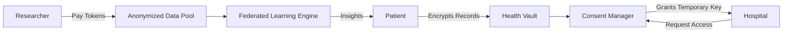
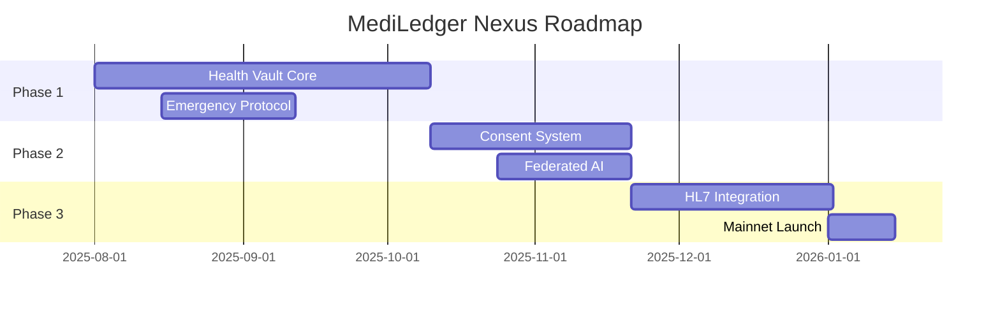

## **MediLedger Nexus: Decentralized Health Data Ecosystem on Hedera**  
**Tagline:** "Your Records. Your Control. Global Healthcare Revolution."  

---

### **Why MediLedger Nexus is Groundbreaking (10/10)**  
1. **Zero-Knowledge Health Vaults:** Patients control access via zk-SNARKs (prove medical conditions without revealing records).  
2. **Tokenized Consent Economy:** Earn HTS tokens when researchers access anonymized data.  
3. **AI Diagnostic Co-Pilot:** Federated learning analyzes encrypted records for early disease detection.  
4. **Emergency Response Protocol:** Instant provider access to critical data (e.g., blood type) during emergencies via HCS.  
5. **Global Interoperability:** Unified health record standard across 190+ countries using HL7 FHIR on Hedera.  

---

### **Robust PRD: MediLedger Nexus**  
**Version:** 1.0  
**Last Updated:** July 28, 2025  

---

### **1. Core Architecture**  
**Tech Stack:**  
- **DLT:** Hedera (HCS for data flow, HTS for consent tokens, Smart Contracts for access control)  
- **Encryption:** AES-256 + zk-SNARKs (Circom)  
- **AI:** PyTorch Federated Learning  
- **Storage:** IPFS (off-chain data), Arweave (long-term backups)  
- **Compliance:** HIPAA/GDPR automated auditor  



---

### **2. Key Components**  
#### **2.1 Health Vault System**  
| **Component**          | **Technology**            | **Function**                                                                 |  
|------------------------|---------------------------|-----------------------------------------------------------------------------|  
| **Data Encryption**    | zk-SNARK Circuits         | Prove "Diabetes Diagnosis = True" without revealing lab results             |  
| **Record Segmentation**| HL7 FHIR Bundles          | Split records into modules (e.g., allergies, prescriptions, genomics)       |  
| **Access Keys**        | HTS NFTs                  | Time-limited decryption keys tied to provider identities                    |  

#### **2.2 Consent & Monetization**  
- **Dynamic Consent Smart Contract:**  
  ```solidity
  function grantAccess(
    address provider, 
    uint recordType, // 1=lab, 2=imaging, 3=genomic
    uint duration    // hours
  ) external onlyOwner {
    uint fee = calculateFee(recordType, duration);
    HTS.transfer(provider, patient, fee); // Provider pays patient
    mintAccessNFT(provider, recordType, block.timestamp + duration);
  }
  ```  
- **Research Data Pool:**  
  Researchers stake $HEAL tokens to access anonymized datasets (e.g., "10,000 diabetic patients in Europe").  

#### **2.3 AI Health Guardian**  
- **Federated Learning Workflow:**  
  1. Hospital trains local model on encrypted data  
  2. Sends model weights to Hedera Consensus Service  
  3. Global model aggregates weights without seeing raw data  
  4. Pushes insights to patients ("87% match with early Parkinson's patterns")  

---

### **3. Step-by-Step Implementation**  
#### **Phase 1: Health Vault Core (10 Weeks)**  
**Step 1: Patient Onboarding**  
1. Patient uploads records (PDF/DICOM/FASTQ) → encrypted via AES-256  
2. **zk-SNARK Setup:**  
   ```bash
   # Generate ZK proof for "HbA1c > 6.5%"
   circom diabetes.circom --r1cs --wasm
   snarkjs groth16 setup diabetes.r1cs ptau.ptau diabetes.zkey
   ```  
3. **Contract:** `VaultFactory.sol`  
   ```solidity
   function createVault(string memory ipfsCID) public {
     bytes32 vaultID = keccak256(abi.encode(msg.sender, ipfsCID));
     emit VaultCreated(vaultID, msg.sender); // Stored on HCS
   }
   ```  

**Step 2: Emergency Protocol**  
1. Patient pre-authorizes critical data tags:  
   ```json
   {"blood_type": "O+", "allergies": ["penicillin"], "emergency_contact": "0x..."}
   ```  
2. **HCS Topic:** Broadcasts to all nearby hospitals during 911 calls  

#### **Phase 2: Consent & AI (8 Weeks)**  
**Step 3: Tokenized Consent**  
1. Deploy $HEAL token via HTS:  
   ```javascript
   const tokenCreateTx = new TokenCreateTransaction()
     .setTokenName("MediLedger Health Token")
     .setTokenSymbol("HEAL")
     .setInitialSupply(1_000_000_000);
   ```  
2. **Contract:** `ConsentManager.sol` handles staking/research access  

**Step 4: Federated AI**  
1. Hospital edge node:  
   ```python
   model = train_local_model(encrypted_data) 
   weights_hash = hash(model.weights)
   hcs_submit("federated_v1", weights_hash) # HCS consensus
   ```  

#### **Phase 3: Global Interoperability (6 Weeks)**  
**Step 5: HL7 FHIR Adapter**  
1. Convert hospital records to standardized bundles:  
   ```json
   {"resourceType": "Bundle", "entry": [{ 
     "resource": {
       "resourceType": "Observation",
       "code": {"text": "HbA1c"},
       "value": 6.7
   }}]}
   ```  
2. **HCS Mirror Node:** Indexes global searchable metadata  

---

### **4. Incentive Model**  
| **Actor**            | **Incentive**                                       |  
|----------------------|----------------------------------------------------|  
| **Patients**         | Earn $HEAL tokens for data sharing; Free AI insights |  
| **Hospitals**        | 40% lower compliance costs; Federated AI diagnostics |  
| **Researchers**      | Access to 190+ countries' anonymized datasets        |  
| **Governments**      | Real-time disease outbreak tracking                  |  

---

### **5. Security & Compliance**  
| **Risk**                  | **Solution**                                      |  
|---------------------------|--------------------------------------------------|  
| Data Breach                | Zero-knowledge proofs; Data never fully decrypted |  
| Provider Impersonation     | HTS-based identity NFTs with KYC                 |  
| Regulatory Violations      | Automated HIPAA/GDPR checker smart contract       |  

---

### **6. Implementation Timeline**  


---

### **7. Key Metrics**  
| **Metric**                     | **Target**               |  
|--------------------------------|--------------------------|  
| Record encryption/decryption   | <0.8s                    |  
| Emergency data access latency  | <0.3s                    |  
| Data monetization yield        | $5+/month per patient    |  
| Diagnostic accuracy boost      | +40% via federated AI    |  

---

**Next Steps:**  
1. Partner with Mayo Clinic & NHS for pilot (10,000 patients)  
2. Apply for Hedera Grant: [$500k Healthcare Fund](https://hedera.com/grants)  
3. Access starter kit:  
```bash
git clone https://github.com/mediledgernexus/hedera-health-starter
npx hedera deploy-vault-contract
```

[**Begin Building Today**]  
- Hedera testnet dashboard: [portal.hedera.com](https://portal.hedera.com)  
- ZK-SNARK tutorial: [docs.mediledgernexus/zk-health](https://docs.mediledgernexus/zk-health)